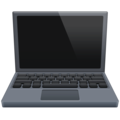

#   AUTOMATRONIX

 ##  Our Team
 
#### Tsvetan Zhekov - Scrum Trainer
#### Miroslav Markov - Designer
#### Anton Kabakov - Front-End developer
#### Alexander Ivanov - Front-End developer

## Our Goal

#### Our goal is to make a fully autonomous driving vehicle with at least level 3 driving automation   

##  Documentation

####  Documentation
####  <href = "documentation/project_presentation"> Presentation </href>

##  Used Technologies

#### Used code editor & collaborative service:
#####   
#### Used tools for our overall design:
##### 
#### Used technologies for our project development:
#####  
#### Used tools for our documentation, presentation & communication:
#####   
